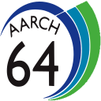

### Welcome! 😊👋

I go by svc64 on the internet. I'm a 12th grade high school student from Israel 🇮🇱

- 📘 I know:
  - Skills:
    
    - Software Development for iOS and macOS 📱
    
    - Reverse Engineering 🔬
  
  - Languages:
    
    - Swift 
    
    - Objective-C 
    
    -  C 
    
    - Python 
    
    - some C++ 
    
    - x86/ARM64 assembly 
- ⚙️ I’m currently working on a 64 bit operating system for the Raspberry Pi
- 💬 Ask me about arm64 and macOS/iOS stuff, I'll probably be able to help :)
- 😄 Pronouns: he/him
- 🔭 I'm interested in:
  - Security and Privacy 🔐
  - File Sharing 📂
  - iOS development and hacking 🌧️📲
